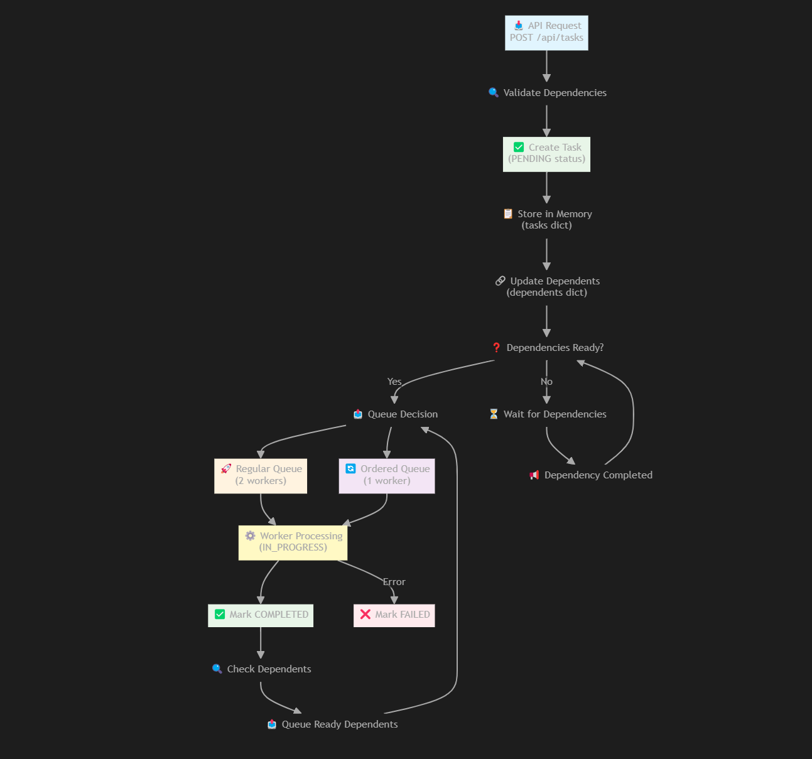

# VIB Homework - TaskMaster

This is a FastAPI-based task management service that accepts tasks, queues them using RabbitMQ, and processes them in the background.

<div align="center">
  <a href="https://www.youtube.com/watch?v=eWtsSxEtDAw">
    
  </a>
  <p><em>TaskMaster Demo Video - Click to watch</em></p>

## 🚀 Features

- **Task Submission**: POST `/api/tasks` endpoint with immediate 202 Accepted response
- **Background Processing**: Separate worker processes that pull tasks from RabbitMQ queues
- **Task Status Tracking**: GET `/api/tasks/{task_id}` endpoint to check task status
- **Task Status Tracking**: GET `/api/tasks` endpoint to get all tasks

## 🏗️ Architecture
<div align="center">
  
  <p><em>System Architecture Overview</em></p>
</div>

### Queue Implementation: RabbitMQ
**Why RabbitMQ?**
- **Durability**: Messages persist even if the service restarts
- **Acknowledgments**: Prevents task loss if workers crash
- **Scalability**: Can handle high message throughput
- **Multiple Queue Support**: Separate queues for different task types
- **Built-in Retry Mechanisms**: Automatic message redelivery on worker failure

### Worker Safety Mechanisms

1. **Preventing Duplicate Processing**:
   - RabbitMQ's `basic_qos(prefetch_count=1)` ensures one message per worker
   - Message acknowledgment only after successful processing
   - Failed tasks are marked as `failed` and acknowledged to prevent redelivery loops

2. **Crash Recovery**:
   - Unacknowledged messages return to queue if worker crashes
   - Durable queues survive RabbitMQ restarts

3. **Task Dependencies & Ordering**:
   - Dependency validation before queuing
   - Dependent tasks automatically queued when dependencies complete
   - Separate ordered queue with single worker for sequential processing

## 🛠️ Installation & Setup

### Prerequisites
- Python 3.8+
- Docker (for RabbitMQ)
- Task CLI for easy commands

### Install Dependencies
```bash
# Create virtual environment 
python -m venv venv
source venv/bin/activate 

# Install dependencies
pip install -r requirements.txt
```

### Start RabbitMQ
```bash
# Using Docker
docker run -it --rm --name rabbitmq -p 5672:5672 -p 15672:15672 rabbitmq:4-management

# Or using Task 
task start-rabbitmq
```

### Start the Application
```bash
# Direct Python execution
python taskmaster.py

# Or using Task
task start-app
```

The API will be available at `http://localhost:8000`
RabbitMQ Management UI at `http://localhost:15672` (guest/guest)

## 📡 API Endpoints

### Create Task
```bash
POST /api/tasks
Content-Type: application/json

{
  "message": "This is a test message",
  "dependencies": [],         
  "requires_ordering": false    
}

Response: 202 Accepted
{
  "id": "a1b2c3d4"
}
```

### Get Task Status
```bash
GET /api/tasks/{task_id}

Response: 200 OK
{
  "id": "a1b2c3d4",
  "status": "completed",
  "message": "This is a test message",
  "dependencies": [],
  "requires_ordering": false
}
```

### Get All Tasks
```bash
GET /api/tasks

Response: 200 OK 
{"id":"task1","status":"completed",...}
{"id":"task2","status":"pending",...}
```

## 🧪 Testing

### Quick Tests Using Task Commands

```bash
# Send 6 normal tasks
task send-test-1

# Send 3 ordered tasks
task send-test-2

# Test dependencies
task send-test-3

# Complex dependency + ordering test
task send-test-4

# Check all tasks
task check-all

# Check specific task
task check TASK_ID=your-task-id
```

## 🎯 Design Decisions & Trade-offs

### In-Memory Storage
- **Pros**: Fast access, simple implementation
- **Cons**: Data lost on restart
- **Production Alternative**: PostgreSQL/Redis for persistence

### Thread-Based Workers
- **Pros**: Simple implementation within single process
- **Cons**: 
  - **GIL Limitation**: Only one thread executes Python code at a time, limiting CPU parallelism
  - **Shared Memory**: Potential race conditions with shared data structures
  - **Resource Contention**: Multiple threads competing for connections/resources
  - **Error Isolation**: Thread failures harder to monitor and handle gracefully
- **Production Alternative**: Separate worker processes or Celery

---

**Note**: This is a homework submission demonstrating core concepts. For production use, consider additional features like persistence, monitoring, authentication, and horizontal scaling.
